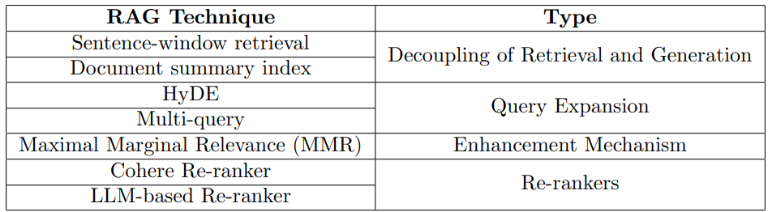

# ARAGOG: Advanced RAG Output Grading
- [ArXiv link](https://arxiv.org/pdf/2404.01037.pdf)
- [Github repo](https://github.com/predlico/ARAGOG/tree/main)
## Summary

This paper presents a comprehensive evaluation of various Retrieval-Augmented Generation (RAG) techniques aimed at optimizing the retrieval process in large language models (LLMs). RAG techniques are designed to enhance LLMs' ability to integrate external knowledge sources into their outputs, addressing the limitation of relying solely on their training data.

The study assesses the impact of different RAG techniques on two key metrics: Retrieval Precision and Answer Similarity. Retrieval Precision measures the relevance of the retrieved context to the given question, while Answer Similarity evaluates how closely the system's answers align with reference responses.

Key findings and insights from the study:

1. **Sentence Window Retrieval**: This technique excels at improving retrieval precision by tailoring the text chunk size for retrieval (single sentences) and generation (multiple sentences). However, its performance on Answer Similarity is variable, suggesting potential limitations in translating the retrieved information into semantically aligned answers.

2. **Hypothetical Document Embedding (HyDE)** and **LLM Reranking**: These techniques significantly enhance retrieval precision, outperforming the baseline Naive RAG system. However, they come with increased latency and cost due to additional LLM calls required.

3. **Maximal Marginal Relevance (MMR)** and **Cohere Rerank**: These established techniques did not demonstrate significant advantages over the baseline Naive RAG system, contrary to expectations.

4. **Multi-query**: Surprisingly, this technique underperformed compared to the Naive RAG baseline, indicating potential limitations in its application.

5. **Document Summary Index**: This approach exhibited satisfactory performance, but it requires an upfront investment in generating summaries for each document in the corpus.

## Ideas and Future Work

1. **Knowledge Graph RAG**: Integrating Knowledge Graphs with RAG systems could potentially enhance retrieval precision and contextual relevance by leveraging the rich, relationship-based data structure of Knowledge Graphs.

2. **Unfrozen RAG Systems**: Adapting RAG components, such as embedding models and rerankers, directly to specific datasets could lead to more adaptable and effective RAG systems tailored to diverse application needs.

3. **Experiment Replication across Diverse Datasets**: Replicating the experiments across multiple datasets is crucial to verify the robustness and generalizability of the findings.

4. **Auto-RAG**: Exploring the concept of automatically optimizing RAG system configurations, similar to Auto-ML in traditional machine learning, could streamline the process of selecting optimal RAG components and parameters.

The paper concludes by emphasizing the importance of continued research in this area and invites the community to further explore and extend the findings presented in this study. The authors have made their experimental pipeline publicly available through a GitHub repository to facilitate replication and extension of their work.

