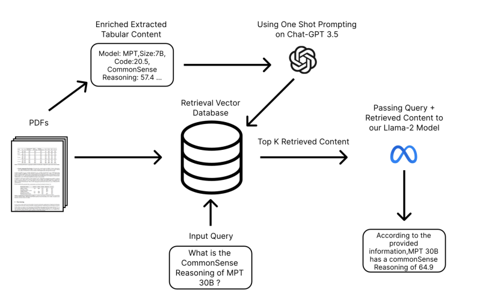
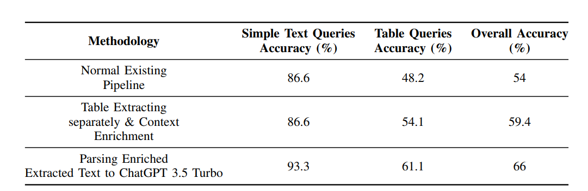

# Beyond Extraction: Contextualising Tabular Data for Efficient Summarisation by Language Models
- [ArXiv link](https://arxiv.org/pdf/2401.02333)
## Abstract

- The conventional Retrieval-Augmented Generation (RAG) architecture has proven effective for retrieving information from diverse documents.
- However, challenges arise in handling complex table queries, especially within PDF documents containing intricate tabular structures.
- This research introduces an innovative approach to enhance the accuracy of complex table queries in RAG-based systems.
- The methodology involves:
    - Storing PDFs in the retrieval database and extracting tabular content separately
    - Enriching the extracted tables by concatenating headers with corresponding values
    - Employing a fine-tuned version of the Llama-2-chat language model for summarisation within the RAG architecture
    - Augmenting the tabular data with contextual sense using the ChatGPT 3.5 API through a one-shot prompt
    - Feeding the enriched data into the retrieval database alongside other PDFs
- The approach aims to significantly improve the precision of complex table queries, offering a promising solution to a longstanding challenge in information retrieval.

## Introduction

- The RAG architecture is a robust framework for retrieving information from diverse documents.
- However, it faces challenges when dealing with complex table queries, particularly within PDF documents with intricate tabular structures.
- Previous studies have not made significant improvements, especially in modifying the extracted data.
- The proposed approach:
    - Stores PDF documents in the retrieval database
    - Separates and enriches tabular content by concatenating headers with corresponding values
    - Integrates a fine-tuned version of the Llama-2-chat language model for summarisation within the RAG architecture
    - Augments the enriched tabular data with contextual sense using the ChatGPT 3.5 API through a one-shot prompt
    - Stores the enriched data in the retrieval database alongside the original PDFs

## Methodology

### A. Model Used in RAG Architecture

- The framework integrates the Llama-2 language model, fine-tuned for summarization.
- Llama-2 enhances contextual awareness through selective retrieval of relevant knowledge and past context.
- It is trained on large datasets to develop a comprehensive understanding of summarization across diverse topics and styles.

### B. Dataset

- The dataset comprises a diverse array of policy documents from authoritative entities.
- It includes 200 carefully designed queries, with a balanced representation of text-focused and table-related inquiries.

### C. Experiment Setup

#### Query Processing

- The experiment includes 200 diverse queries:
    - 170 queries delving into tabular data
        - 110 complex queries probing intricate table relationships
        - 60 simpler table structure queries
    - 30 control benchmarks focusing on non-tabular text queries

#### Data Preparation

- PDF documents are stored in the retrieval database.
- Tabular content is extracted separately using the Camelot library.
- Column headings are concatenated with corresponding row values to enrich context.

#### Integration with Chat-GPT

- The Llama-2 model is used for summarisation within the RAG architecture.
- The enriched tabular data is augmented using the ChatGPT 3.5 API with a one-shot prompt.
- The augmented data is stored in the retrieval database alongside the original PDFs.

## Results

- The normal existing pipeline achieved 86.6% accuracy for text-based queries but only 48.2% for table queries (overall 54% accuracy).
- Extracting tables separately and enriching context improved table query accuracy to 54.1% (overall 59.4% accuracy).
- Parsing enriched data with ChatGPT 3.5 Turbo achieved:
    - 93.3% accuracy for text queries
    - 61.1% accuracy for table queries
    - 66% overall accuracy

## Conclusions

- The proposed approach enhances the RAG architecture's ability to handle complex table queries within diverse policy documents.
- Integrating advanced language models like Llama-2-chat and ChatGPT 3.5 API propels accuracy metrics, particularly for complex table queries.
- The observed improvements highlight the profound understanding achieved through context enrichment and advanced language model integration.
- The approach paves the way for future advancements in information retrieval systems, effectively bridging the gap between human cognition and intricate data structures.
